# cadernoDeReceitas
Repositório para o trabalho da disciplina (724101) Desenvolvimento Web Front- End da PUC Minas. É um site pessoal de receitas organizado por tipos de cozinha, seja brasileira, italiana, indiana, chinesa, francesa, árabe.

## Dados Básicos
1. **Nome:** Henrique Marques Pyramo
2. **Matrícula:** 429927
3. **Proposta de projeto escolhida:** Proposta: Coleções e Itens | Entidade principal: Coleção | Entidade Secundária: Objeto / Item do acervo | Exemplos Temáticos: Galeria e obras, álbuns e faixas, exposições e peças
4. **Breve descrição sobre o projeto:** Site pessoal sobre receitas que eu sei fazer, receitas que gosto, e receitas que aprendi.

## Semana 6
### Print da página estilo desktop
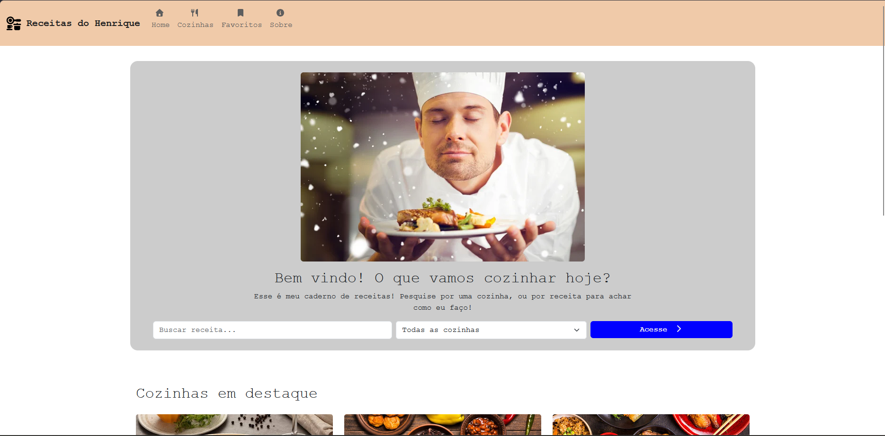
---
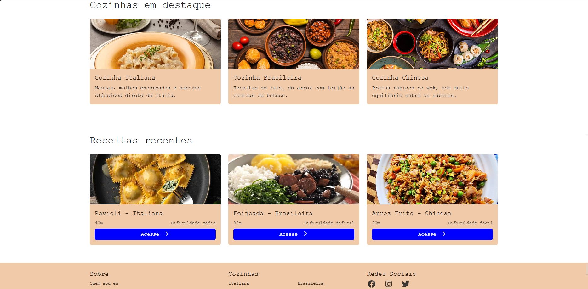
---
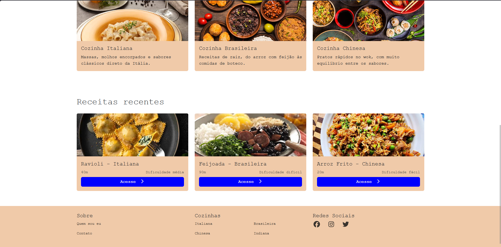
---

### Print da página estilo Mobile
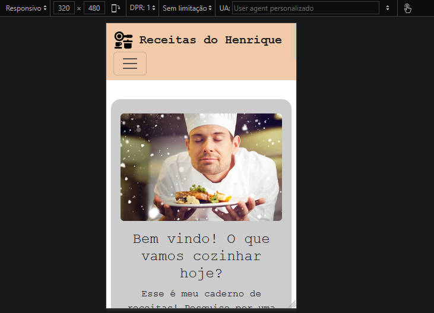
---
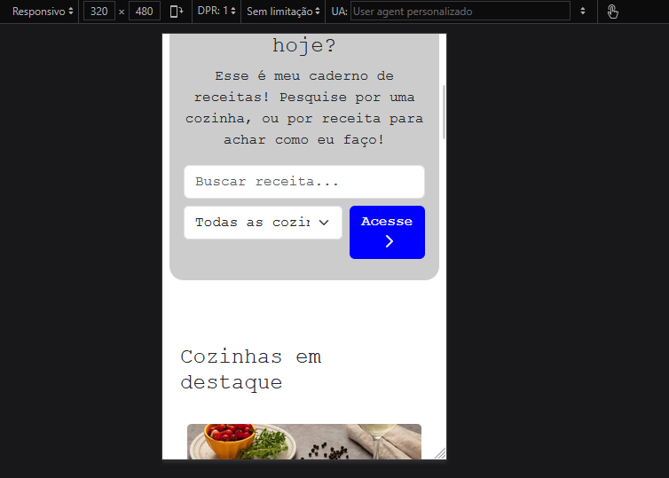
---
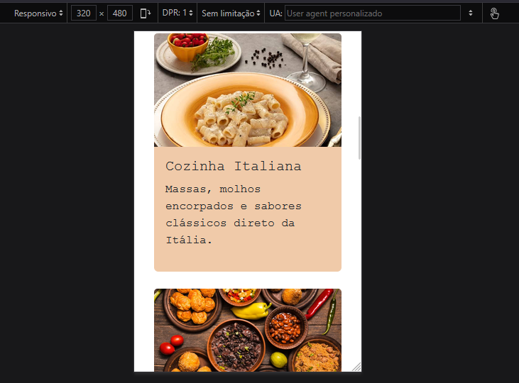
---
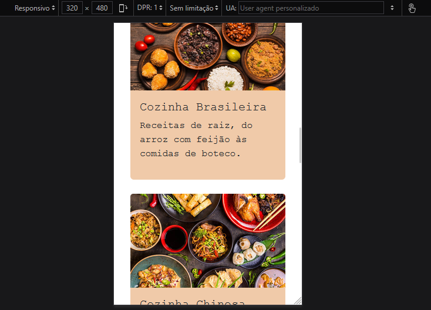
---
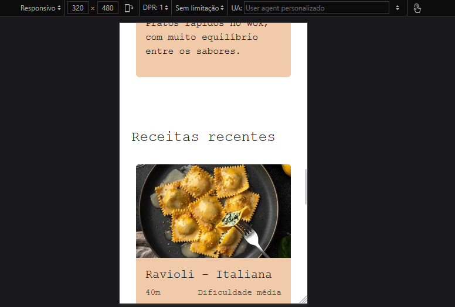
---
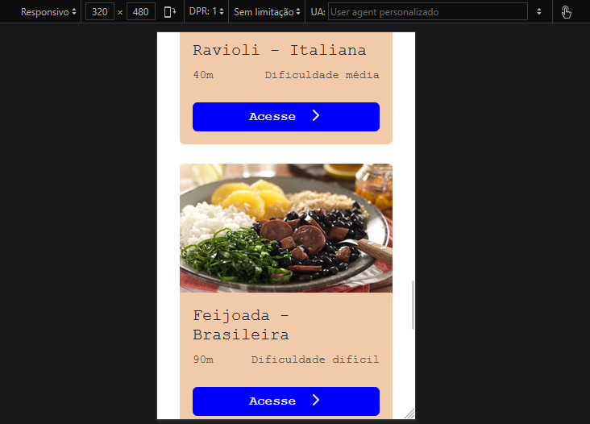
---
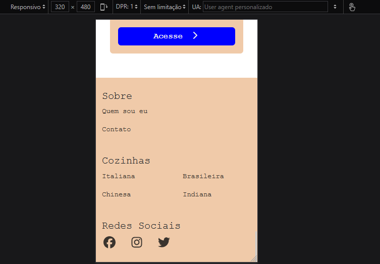
---

## Semana 5
### Print da home-page responsiva
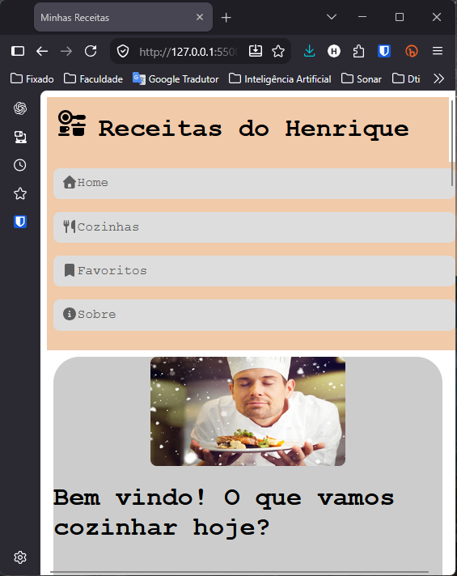
---
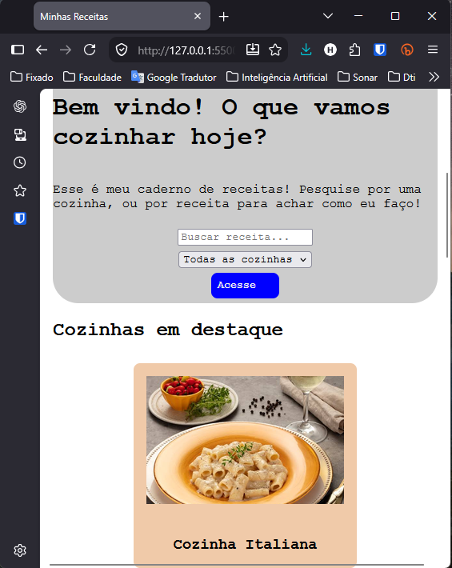
---
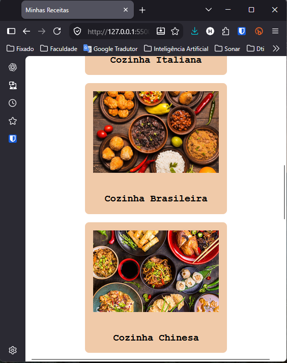
---
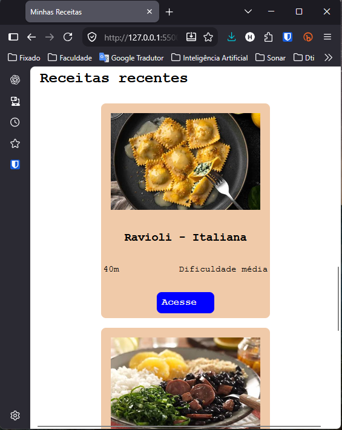
---
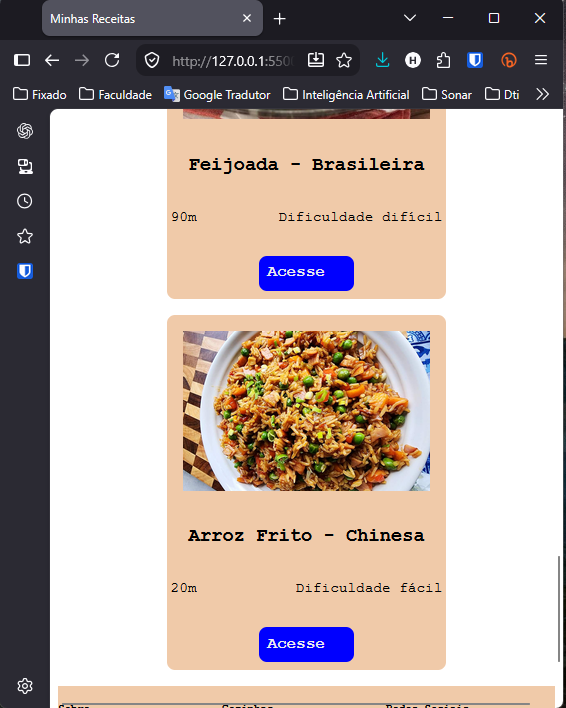
---
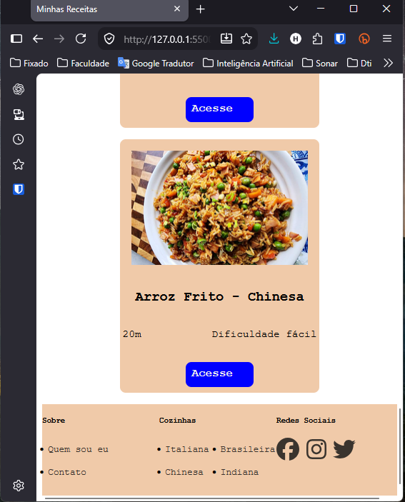
---

## Semana 4
## Imagem do esboço (wireframe) criado para o projeto
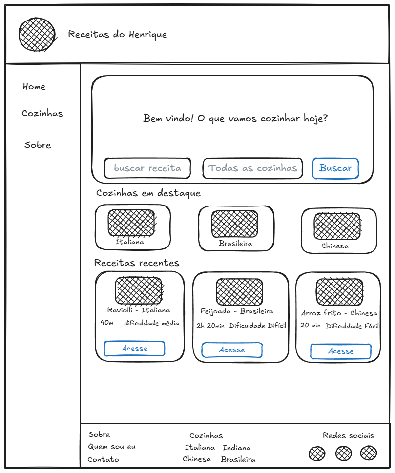

## Print da home-page criada para o projeto
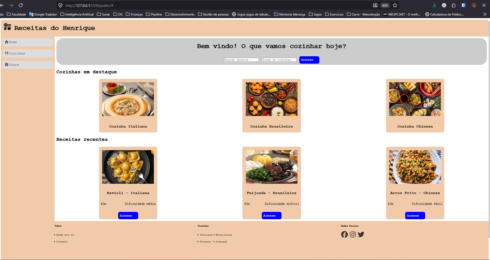
